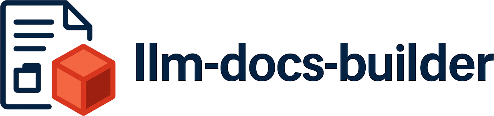
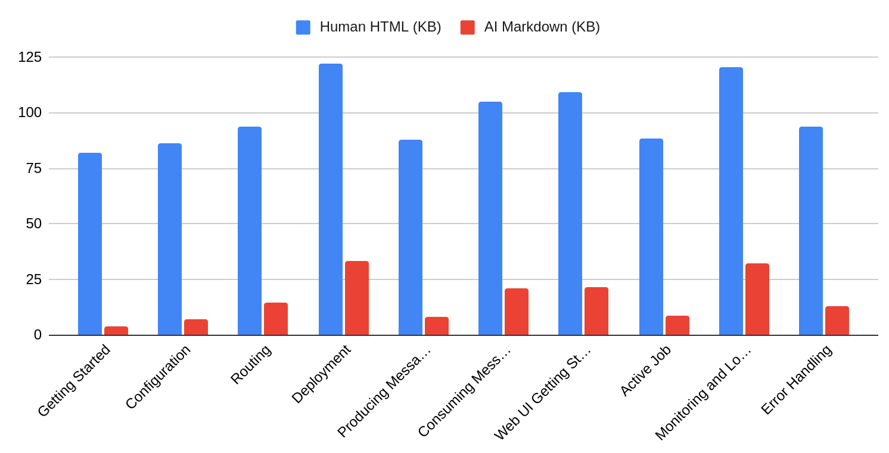

<p align="center">
  
</p>

# llm-docs-builder

[](
  https://github.com/mensfeld/llm-docs-builder/actions/workflows/ci.yml)

**Optimize your documentation for LLMs and RAG systems. Reduce token consumption by 67-95%.**

llm-docs-builder transforms markdown documentation to be AI-friendly and generates llms.txt files. It normalizes links, removes unnecessary content, optimizes documents for LLM context windows, and enhances documents for RAG retrieval with hierarchical heading context and metadata.

## The Problem

When LLMs fetch documentation, they typically get HTML pages designed for humans - complete with navigation bars, footers, JavaScript, CSS, and other overhead. This wastes 70-90% of your context window on content that doesn't help answer questions.

**Real-world results from [Karafka documentation](https://karafka.io/docs/) (10 pages analyzed):**

<p align="center">
  
</p>

**Average reduction: 83% fewer tokens**

## Quick Start

### Measure Your Current Token Waste

```bash
# Using Docker (no Ruby installation needed)
docker pull mensfeld/llm-docs-builder:latest

# Compare your documentation page
docker run mensfeld/llm-docs-builder compare \
  --url https://yoursite.com/docs/getting-started.html
```

**Example output:**
```
============================================================
Context Window Comparison
============================================================

Human version:  127.4 KB (~32,620 tokens)
  Source: https://karafka.io/docs/Pro-Virtual-Partitions/ (User-Agent: human)

AI version:     46.3 KB (~11,854 tokens)
  Source: https://karafka.io/docs/Pro-Virtual-Partitions/ (User-Agent: AI)

------------------------------------------------------------
Reduction:      81.1 KB (64%)
Token savings:  20,766 tokens (64%)
Factor:         2.8x smaller
============================================================
```

### Transform Your Documentation

```bash
# Single file
llm-docs-builder transform --docs README.md

# Fetch and transform a remote page
llm-docs-builder transform --url https://yoursite.com/docs/page.html

# Bulk transform with config
llm-docs-builder bulk-transform --config llm-docs-builder.yml
```

## Installation

### Docker (Recommended)

```bash
docker pull mensfeld/llm-docs-builder:latest
alias llm-docs-builder='docker run -v $(pwd):/workspace mensfeld/llm-docs-builder'
```

### RubyGems

```bash
gem install llm-docs-builder
```

## Features

### Measure and Compare

```bash
# Compare what your server sends to humans vs AI
llm-docs-builder compare --url https://yoursite.com/docs/page.html

# Compare remote HTML with local markdown
llm-docs-builder compare \
  --url https://yoursite.com/docs/api.html \
  --file docs/api.md
```

### Generate llms.txt

```bash
# Create standardized documentation index
llm-docs-builder generate --config llm-docs-builder.yml
```

## Configuration

```yaml
# llm-docs-builder.yml
docs: ./docs
base_url: https://myproject.io
title: My Project
description: Brief description
body: Optional body content between description and sections
output: llms.txt
suffix: .llm
verbose: false

# Basic options
convert_urls: true
remove_comments: true
remove_badges: true
remove_frontmatter: true
normalize_whitespace: true

# Additional compression options
remove_code_examples: false
remove_images: true
remove_blockquotes: true
remove_duplicates: true
remove_stopwords: false
simplify_links: true
generate_toc: true
custom_instruction: "This documentation is optimized for AI consumption"

# RAG enhancement options
normalize_headings: true          # Add hierarchical context to headings
heading_separator: " / "          # Separator for heading hierarchy
include_metadata: true            # Enable enhanced llms.txt metadata
include_tokens: true              # Include token counts in llms.txt
include_timestamps: true          # Include update timestamps in llms.txt
include_priority: true            # Include priority labels in llms.txt
calculate_compression: false      # Calculate compression ratios (slower)

# Exclusions
excludes:
  - "**/private/**"
  - "**/drafts/**"
```

## CLI Commands

```bash
llm-docs-builder compare [options]        # Measure token savings
llm-docs-builder transform [options]      # Transform single file
llm-docs-builder bulk-transform [options] # Transform directory
llm-docs-builder generate [options]       # Generate llms.txt
llm-docs-builder parse [options]          # Parse llms.txt
llm-docs-builder validate [options]       # Validate llms.txt
llm-docs-builder version                  # Show version
```

**Common options:**
```
-c, --config PATH    Configuration file
-d, --docs PATH      Documentation path
-o, --output PATH    Output file
-u, --url URL        URL for comparison
-v, --verbose        Detailed output
```

## Serving Optimized Docs to AI Bots

After using `bulk-transform` with `suffix: .llm`, configure your web server to serve optimized versions to AI bots:

**Apache (.htaccess):**
```apache
SetEnvIf User-Agent "(?i)(openai|anthropic|claude|gpt)" IS_LLM_BOT
RewriteCond %{ENV:IS_LLM_BOT} !^$
RewriteRule ^(.*)\.md$ $1.llm.md [L]
```

**Nginx:**
```nginx
map $http_user_agent $is_llm_bot {
    default 0;
    "~*(?i)(openai|anthropic|claude|gpt)" 1;
}

location ~ ^/docs/(.*)\.md$ {
    if ($is_llm_bot) {
        rewrite ^(.*)\.md$ $1.llm.md last;
    }
}
```

## Docker Usage

```bash
# Pull image
docker pull mensfeld/llm-docs-builder:latest

# Compare (no volume needed for remote URLs)
docker run mensfeld/llm-docs-builder compare \
  --url https://yoursite.com/docs

# Transform with volume mount
docker run -v $(pwd):/workspace mensfeld/llm-docs-builder \
  bulk-transform --config llm-docs-builder.yml
```

**CI/CD Example (GitHub Actions):**
```yaml
- name: Optimize documentation
  run: |
    docker run -v ${{ github.workspace }}:/workspace \
      mensfeld/llm-docs-builder bulk-transform --config llm-docs-builder.yml
```

## Compression Examples

**Input markdown:**
```markdown
---
layout: docs
---

# API Documentation

[](https://ci.com)

> Important: This is a note

[Click here to see the complete API documentation](./api.md)

api = API.new
```

**After transformation (with default options):**

```markdown
# API Documentation

[complete API documentation](./api.md)

api = API.new
```

**Token reduction:** ~40-60% depending on configuration

## RAG Enhancement Features

### Heading Normalization

Transform headings to include hierarchical context, making each section self-contained for RAG retrieval:

**Before:**
```markdown
# Configuration
## Consumer Settings
### auto_offset_reset

Controls behavior when no offset exists...
```

**After (with `normalize_headings: true`):**
```markdown
# Configuration
## Configuration / Consumer Settings
### Configuration / Consumer Settings / auto_offset_reset

Controls behavior when no offset exists...
```

**Why this matters for RAG:** When documents are chunked and retrieved independently, each section retains full context. An LLM seeing just the `auto_offset_reset` section knows it's about "Configuration / Consumer Settings / auto_offset_reset" not just generic "auto_offset_reset".

```yaml
# Enable in config
normalize_headings: true
heading_separator: " / "  # Customize separator (default: " / ")
```

### Enhanced llms.txt Metadata

Generate enriched llms.txt files with token counts, timestamps, and priority labels to help AI agents make better decisions:

**Standard llms.txt:**
```markdown
- [Getting Started](https://myproject.io/docs/Getting-Started.md)
- [Configuration](https://myproject.io/docs/Configuration.md)
```

**Enhanced llms.txt (with metadata enabled):**
```markdown
- [Getting Started](https://myproject.io/docs/Getting-Started.md): Quick start guide (tokens:450, updated:2025-10-13, priority:high)
- [Configuration](https://myproject.io/docs/Configuration.md): Configuration options (tokens:2800, updated:2025-10-12, priority:high)
- [Advanced Topics](https://myproject.io/docs/Advanced.md): Deep dive topics (tokens:5200, updated:2025-09-15, priority:medium)
```

**Benefits:**
- AI agents can see token counts → load multiple small docs vs one large doc
- Timestamps help prefer recent documentation
- Priority signals guide which docs to fetch first
- Compression ratios show optimization effectiveness

```yaml
# Enable in config
include_metadata: true      # Master switch
include_tokens: true        # Show token counts
include_timestamps: true    # Show last modified dates
include_priority: true      # Show priority labels (high/medium/low)
calculate_compression: true # Show compression ratios (slower, requires transformation)
```

**Note:** Metadata is formatted according to the llms.txt specification, appearing within the description field using parentheses and comma separators for spec compliance.

### Multi-Section Organization

Documents are automatically organized into multiple sections based on priority, following the llms.txt specification:

**Priority-based categorization:**
- **Documentation** (priority 1-3): Essential docs like README, getting started guides, user guides
- **Examples** (priority 4-5): Tutorials and example files
- **Optional** (priority 6-7): Advanced topics and reference documentation

**Example output:**
```markdown
# My Project

> Project description

## Documentation

- [README](README.md): Main documentation
- [Getting Started](getting-started.md): Quick start guide

## Examples

- [Basic Tutorial](tutorial.md): Step-by-step tutorial
- [Code Examples](examples.md): Example code

## Optional

- [Advanced Topics](advanced.md): Deep dive into advanced features
- [API Reference](reference.md): Complete API reference
```

Empty sections are automatically omitted. The "Optional" section aligns with the llms.txt spec for marking secondary content that can be skipped when context windows are limited.

### Body Content

Add custom body content between the description and documentation sections:

```yaml
# llm-docs-builder.yml
title: My Project
description: Brief description
body: |
  This framework is built on Ruby and focuses on performance.
  Key concepts: streaming, batching, and parallel processing.
docs: ./docs
```

This produces:
```markdown
# My Project

> Brief description

This framework is built on Ruby and focuses on performance.
Key concepts: streaming, batching, and parallel processing.

## Documentation
...
```

## Advanced Compression Options

All compression features can be used individually for fine-grained control:

### Content Removal Options

- `remove_frontmatter: true` - Remove YAML/TOML metadata blocks
- `remove_comments: true` - Remove HTML comments (`<!-- ... -->`)
- `remove_badges: true` - Remove badge/shield images (CI badges, version badges, etc.)
- `remove_images: true` - Remove all image syntax
- `remove_code_examples: true` - Remove fenced code blocks, indented code, and inline code
- `remove_blockquotes: true` - Remove blockquote formatting (preserves content)
- `remove_duplicates: true` - Remove duplicate paragraphs using fuzzy matching
- `remove_stopwords: true` - Remove common stopwords from prose (preserves code blocks)

### Content Enhancement Options

- `generate_toc: true` - Generate table of contents from headings with anchor links
- `custom_instruction: "text"` - Inject AI context message at document top
- `simplify_links: true` - Simplify verbose link text (e.g., "Click here to see the docs" → "docs")
- `convert_urls: true` - Convert `.html`/`.htm` URLs to `.md` format
- `normalize_whitespace: true` - Reduce excessive blank lines and remove trailing whitespace

## License

Available as open source under the [MIT License](https://opensource.org/licenses/MIT).
